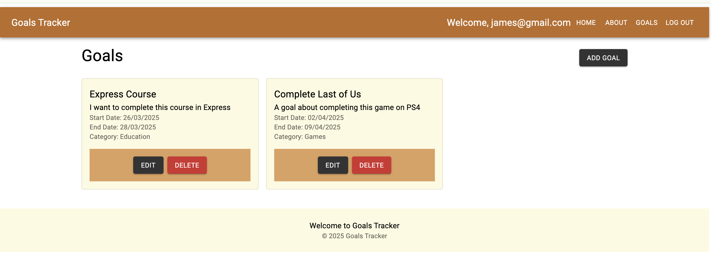
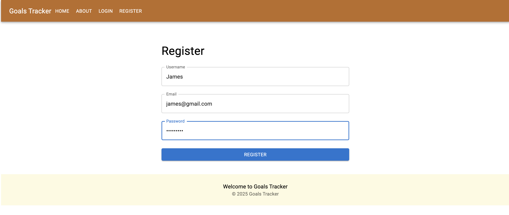
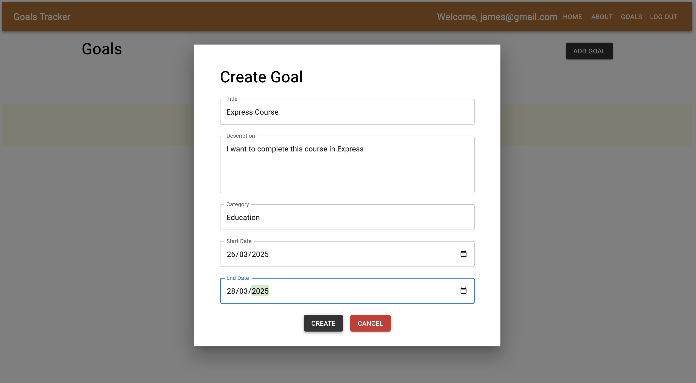

# A Goal setter application in MERN




## Features

- User authentication and authorization (Done)
- Create, update, and delete goals (Done)
- Set deadlines and reminders for goals
- Track progress of goals
- Categorize goals by priority or type (Done)
- Receive notifications for upcoming deadlines
- View goal history and achievements
- Responsive design for mobile and desktop (Done)
- Integration with calendar apps
- Data encryption and security
- User-friendly interface (Done)
- Analytics and reporting on goal progress
- Customizable goal templates
- Support for multiple languages
- Dark mode and light mode options

These are the suggested features a goal setting app should have. This application over a period of time would eventually contain some of these features.

## Screenshots

Below are the screenshots to add goal and register page.





## Deployment using Docker

```
version: '3.8'
services:
  express:
    build:
      context: .
      dockerfile: Dockerfile
    container_name: express_goals
    ports:
      - 5000:5000
    depends_on:
      - mongo

  mongo:
    image: mongo
    container_name: mongo_goals
    restart: unless-stopped
    volumes:
      - ./mongo_data:/data/db
    ports:
      - '27017:27017'

  nginx:
    image: nginx
    container_name: nginx_goals
    restart: unless-stopped
    ports:
      - '80:80'
    volumes:
      - ./nginx/nginx.conf:/etc/nginx/nginx.conf
    depends_on:
      - express

volumes:
  mongo_data:
    external: true
```

This uses Docker containers for deployment. We have containers for Nginx, the back-end and mongodb database. Before running the docker-compose command we create a front-end build using the command 
from inside the client folder.

```
npm run build
```

We use volumes for data persistence in our MongoDB database. When we remove the containers using docker-compose down and create those again using docker-compose up, we'd notice our database remains intact.

```
docker-compose up
docker-compose down

docker-compose down --volumes --remove-orphans && docker-compose up --build
```

Let's breakdown some of the complex part of the previous code above.

--volumes: This crucial flag tells Docker Compose to also remove the named volumes associated with your containers. This is important if you want to completely reset your data or if you've made changes to your volume configurations. Be careful! This will delete your data if it is stored in volumes.

--remove-orphans: This option removes any containers that were created by a previous docker-compose up command but are no longer defined in your current docker-compose.yml. This is helpful for cleaning up old containers that might be lingering.
&&

docker-compose up: This command starts and creates the containers defined in your docker-compose.yml file.
--build: This flag tells Docker Compose to build or rebuild any images that are specified in your docker-compose.yml file's build section. This is essential when you've made changes to your Dockerfiles or application code.
